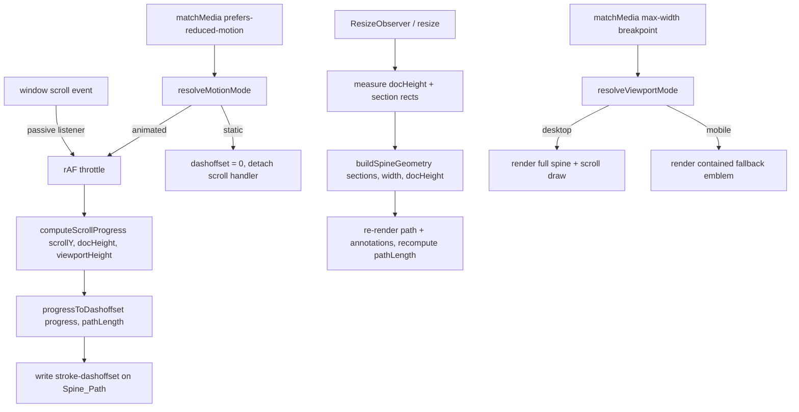

# Design Document

## Overview

The Rapier Spine Motif replaces the generic `NodeNetwork` decoration with a single, continuous,
blueprint-style rapier illustration that runs the full scrollable height of the page as a vertical
"through-line." The rapier is drawn as thin, single-weight, unfilled stroked line art in the site's
`--accent` gold, sits behind all page content at reduced opacity, and "draws itself" from top to
bottom as the visitor scrolls. Monospace callout labels and part annotations (pommel, grip,
guard/quillon, blade) are anchored to specific sections, and a graceful, contained fallback replaces
the full-height line on narrow viewports.

The core design tension is: **the motif must span and react to the entire document, yet it is a
single decorative element that must not interfere with content layout, readability, interactivity,
the existing `Reveal` scroll-reveal system, or accessibility.** The design resolves this by mounting
one absolutely-positioned SVG layer behind the content stack, sizing it in device pixels to the
measured document height, generating its geometry from measured section positions, and animating a
single compositor-friendly stroke property (`stroke-dashoffset`) in response to a
`requestAnimationFrame`-throttled scroll listener.

### Key research findings informing the design

- **SVG line drawing via `stroke-dasharray` / `stroke-dashoffset`.** Setting `stroke-dasharray`
  equal to the path's total length (from `SVGGeometryElement.getTotalLength()`) and then reducing
  `stroke-dashoffset` from that length toward `0` reveals the stroke progressively. This is the
  standard, well-supported "line drawing" technique.
  ([CSS-Tricks: Animating SVG line drawing](https://css-tricks.com/svg-line-animation-works/) —
  content was rephrased for compliance with licensing restrictions.)
- **`stroke-dashoffset` is comparatively cheap to update.** Unlike properties that trigger layout,
  updating `stroke-dashoffset` repaints the path without reflowing the document. Combined with a
  single write per animation frame, this avoids the layout thrashing called out in Requirement 5.6.
- **Scroll-driven animations (`animation-timeline: scroll()`).** Modern browsers can bind an
  animation's progress directly to scroll progress on the compositor, with no JS scroll listener at
  all. Support is not universal, so this is used as a progressive enhancement layer over the
  rAF-driven baseline rather than the sole mechanism.
  ([MDN: CSS scroll-driven animations](https://developer.mozilla.org/en-US/docs/Web/CSS/CSS_scroll-driven_animations)
  — content was rephrased for compliance with licensing restrictions.)
- **`prefers-reduced-motion`** is read via `window.matchMedia('(prefers-reduced-motion: reduce)')`,
  which also fires `change` events, allowing the component to react if the user changes the OS
  setting while the page is open. When no preference is reported, the query does not match and the
  animation is enabled by default (Requirement 7.3).
- **Decorative SVG semantics.** A purely decorative SVG should be removed from the accessibility
  tree with `aria-hidden="true"` (and `role="presentation"`/`focusable="false"` on the SVG). This
  satisfies Requirement 2.6 and lets Requirement 7.4 be met via its "expose as decorative and
  hidden" branch rather than requiring a 4.5:1 text-contrast ratio.

## Architecture

### Placement in the component tree

The `RapierSpine` component is mounted **once**, as a sibling of `<main>` inside `App.jsx`, so a
single instance spans every section (Requirement 8.3, 8.4):

```jsx
// App.jsx
function App() {
  return (
    <>
      <Nav />
      <RapierSpine />      {/* single decorative layer, behind content */}
      <main>
        <Hero /> <About /> <Projects /> <Philosophy />
        <Timeline /> <Skills /> <Contact />
      </main>
      <Footer />
    </>
  );
}
```

### Stacking / layering strategy

The spine must render behind section content while remaining visible through transparent content
areas at reduced opacity (Requirements 2.3, 2.7).

```
z-index layering (within #root):
  Nav ............. position: fixed;    z-index: 1000
  main ............ position: relative; z-index: 1      (content sits above spine)
  RapierSpine ..... position: absolute; z-index: 0      (behind content)
  html background . var(--bg)                            (bottom)
```

Because the site's sections have transparent backgrounds (only `.hero-right` and cards paint a
`--surface` fill), the low-opacity spine naturally shows through the gutters and text areas without
being clipped. The spine layer sets `pointer-events: none` so it never intercepts clicks, keeping
all controls interactive (Requirement 2.3).

### Sizing model: document-pixel coordinate space

Rather than fighting `preserveAspectRatio` distortion, the SVG uses a **1 unit = 1 CSS pixel**
coordinate space:

- The container `<div class="rapier-spine">` is absolutely positioned at `top: 0`, spanning a fixed
  narrow column width (e.g. `clamp(160px, 18vw, 280px)`) and the full measured document height.
- The `<svg>` uses `viewBox="0 0 {W} {docHeight}"` with `width`/`height` matching, so path
  coordinates are authored directly in document pixels. This makes anchoring annotations to measured
  section positions trivial and keeps stroke width visually constant (no non-uniform scaling).
- `docHeight` is measured from `document.documentElement.scrollHeight` and recomputed via a
  `ResizeObserver` on `document.body` plus a `window` `resize` listener, so the spine re-lengthens
  when responsive reflow or content changes alter page height (Requirement 2.5).

### Data flow



### Coexistence with the existing Reveal system

`RapierSpine` is fully independent of `Reveal.jsx`. It does not read, modify, or observe any
`.reveal` element, and it adds no classes to section content. It owns:

- its own `scroll` listener (passive, rAF-throttled) used only to update its own
  `stroke-dashoffset`, and
- its own `ResizeObserver`/`matchMedia` listeners.

Because the two systems share no DOM or state, the existing reveal transitions are unaffected
(Requirement 5.5). Both may run simultaneously; the spine's scroll handler performs a single
compositor-friendly write and never forces synchronous layout inside the reveal elements.

## Components and Interfaces

### `RapierSpine` (new) — `src/components/RapierSpine.jsx`

The single decorative layer. Responsibilities:

- Measure document height and section anchor positions.
- Build the spine path geometry and part annotations in document-pixel space.
- Resolve viewport mode (desktop full-spine vs. mobile fallback) and motion mode (animated vs.
  static) from media queries.
- On desktop + animated mode, subscribe to scroll and update `stroke-dashoffset` per frame.
- Render as an `aria-hidden`, `pointer-events: none` background layer.

Props (all optional, with sensible defaults so `<RapierSpine />` works with no props):

| Prop             | Type       | Default                                                        | Purpose |
|------------------|------------|----------------------------------------------------------------|---------|
| `sectionIds`     | `string[]` | `['hero','about','projects','philosophy','timeline','skills','contact']` | Ordered anchors, top→bottom, used for geometry + annotations. |
| `mobileBreakpoint` | `number` | `768`                                                          | Width (px) at/below which the fallback renders. Matches the CSS `768px` breakpoint. |
| `maxOpacity`     | `number`   | `0.32`                                                         | Layer opacity; must satisfy `0 < maxOpacity <= 0.5` (Requirement 3.6). |
| `columnWidth`    | `string`   | `'clamp(160px, 18vw, 280px)'`                                  | Horizontal footprint of the spine column. |

The component exposes no imperative API; it is self-contained.

### Internal pure helpers (unit-testable, PBT targets) — `src/components/rapierSpine.geometry.js`

Extracting the math into pure functions keeps the React component thin and makes the logic testable
without a DOM:

```ts
// Clamped scroll progress in [0, 1].
computeScrollProgress(scrollY: number, docHeight: number, viewportHeight: number): number

// Maps progress to a dashoffset in [0, pathLength]; progress 1 -> 0 (fully drawn),
// progress 0 -> pathLength (undrawn). Monotonically non-increasing in progress.
progressToDashoffset(progress: number, pathLength: number): number

// 'mobile' if width <= breakpoint, else 'desktop'.
resolveViewportMode(width: number, breakpoint: number): 'mobile' | 'desktop'

// 'static' if prefers-reduced-motion is reduce, else 'animated'.
resolveMotionMode(prefersReduced: boolean): 'static' | 'animated'

// Given ordered section rects (top, height) in document space, returns anchor points and
// part annotations in fixed top->bottom order (pommel -> ... -> blade tip).
buildSpineGeometry(sections: SectionRect[], width: number, docHeight: number): SpineGeometry
```

### `Hero` (modified) — `src/components/Hero.jsx`

- Remove `import NodeNetwork from './NodeNetwork'` and the `<NodeNetwork />` usage (Requirement 1.2).
- All other markup — eyebrow, title, sub, action buttons, and the `hero-timeline` domain list — is
  left byte-for-byte unchanged (Requirement 1.4).
- The now-empty `.hero-atmosphere`/`.hero-right` container is retained as an empty decorative slot
  (the spine renders behind it globally). This preserves the hero's two-column grid layout.

### `App` (modified) — `src/App.jsx`

Adds the single `<RapierSpine />` mount and applies the `z-index: 1; position: relative` treatment
to `<main>` so content layers above the spine.

### Removed modules

- `src/components/NodeNetwork.jsx` and `src/components/NodeNetworkStatic.jsx` are deleted once the
  Hero import is removed and no module references them (Requirement 1.3). A repository search
  confirms `NodeNetwork` is imported only by `Hero.jsx` within the React app. (The standalone legacy
  file `index-v4.html` at the repo root contains its own inline copy and is not part of the Vite
  build, so it is unaffected.)

## Data Models

### `SectionRect`

Measured position of a page section in document-pixel space.

```ts
interface SectionRect {
  id: string;        // matches a section DOM id, e.g. 'hero'
  top: number;       // distance from document top to section top, in px (>= 0)
  height: number;    // section height in px (> 0)
}
```

### `PartAnnotation`

A schematic label naming a rapier part, bound to a section.

```ts
interface PartAnnotation {
  part: 'pommel' | 'grip' | 'guard' | 'blade'; // canonical part token
  label: string;        // monospace display text, e.g. 'POMMEL', 'GUARD / QUILLON'
  sectionId: string;    // associated section
  x: number;            // annotation anchor x in document px (in the gutter)
  y: number;            // annotation anchor y in document px (section vertical center)
  tickLength: number;   // measurement-tick length in px
}
```

### `SpineGeometry`

The full generated geometry for one render.

```ts
interface SpineGeometry {
  width: number;                 // svg coordinate width in px
  height: number;                // == docHeight
  pathD: string;                 // SVG path 'd' for the Spine_Path (blade+hilt+guard outline)
  anchors: Record<string, {x: number; y: number}>; // sectionId -> point on spine
  annotations: PartAnnotation[]; // fixed top->bottom order
  ticks: Array<{x1:number;y1:number;x2:number;y2:number}>; // measurement ticks
}
```

### Fixed part sequence (top → bottom)

The anatomical order is fixed and independent of measured positions (Requirements 2.4, 4.4). Top of
page is the hilt end; the blade extends down to the tip at the bottom:

| Order | Section     | Part token | Displayed label     | Blueprint element                          |
|-------|-------------|------------|---------------------|--------------------------------------------|
| 0     | hero        | `pommel`   | `POMMEL`            | Rounded counterweight cap + ticks          |
| 1     | about       | `grip`     | `GRIP`              | Bound handle, hatch marks                   |
| 2     | projects    | `guard`    | `GUARD / QUILLON`   | Swept crossguard + knuckle bow curve        |
| 3     | philosophy  | `blade`    | `BLADE — FORTE`     | Blade base (thicker forte region), fuller   |
| 4     | timeline    | (blade)    | `FULLER`            | Blade mid-line groove + dimension ticks     |
| 5     | skills      | (blade)    | `FOIBLE`            | Blade upper third narrowing                 |
| 6     | contact     | (blade)    | `POINT`             | Blade tip                                   |

Only the four required part tokens (`pommel`, `grip`, `guard`, `blade`) are emitted as
`PartAnnotation` entries with distinct part tokens (Requirement 3.5); the additional blade labels
(`FULLER`, `FOIBLE`, `POINT`) are blade sub-annotations sharing the `blade` token, preserving the
fixed order without introducing new part categories.

### `ScrollState` (transient, per frame)

```ts
interface ScrollState {
  scrollY: number;        // window.scrollY
  docHeight: number;      // documentElement.scrollHeight
  viewportHeight: number; // window.innerHeight
  progress: number;       // computeScrollProgress(...) in [0,1]
}
```

### Design token usage

All visual constants derive from existing `:root` tokens (Requirements 3.2, 3.4, 3.7, 8.2); the
component defines no new hard-coded color or font literals for these roles:

| Role                     | Token          |
|--------------------------|----------------|
| Stroke / line art        | `var(--accent)`|
| Callout label text       | `var(--accent)` on `--font-mono` |
| Contrast reference bg    | `var(--bg)`    |
| Any hairline/border feel | `var(--border)`|
| Label typography         | `var(--font-mono)` |

## Correctness Properties

*A property is a characteristic or behavior that should hold true across all valid executions of a
system — essentially, a formal statement about what the system should do. Properties serve as the
bridge between human-readable specifications and machine-verifiable correctness guarantees.*

The visual and structural aspects of this feature (stacking order, opacity styling, decorative
semantics, token usage, presence of specific labels) are verified with example-based and smoke
tests — see the Testing Strategy. The properties below target the **pure logic layer** extracted
into `rapierSpine.geometry.js`, where behavior varies meaningfully with input (scroll position,
document height, section layout, viewport width, motion preference) and 100+ generated cases expose
boundary and ordering bugs that a handful of examples would miss.

### Property 1: Scroll-linked draw is a monotonic mapping with correct endpoints

*For any* `pathLength >= 0` and any two progress values `a` and `b` in `[0, 1]` with `a <= b`,
`progressToDashoffset(a, pathLength) >= progressToDashoffset(b, pathLength)`, every result lies in
`[0, pathLength]`, `progressToDashoffset(0, pathLength) == pathLength` (only the topmost portion
drawn), and `progressToDashoffset(1, pathLength) == 0` (the entire path drawn). Because the drawn
length is a deterministic function of progress, scrolling up (lower progress) always reduces the
drawn portion to match position.

**Validates: Requirements 5.1, 5.2, 5.3, 5.4, 7.2**

### Property 2: Spine extent matches the document and section span

*For any* valid ordered list of `SectionRect`s (hero first, contact last, each with `height > 0`)
and any `docHeight` at least the contact section's bottom, `buildSpineGeometry(...).height == docHeight`,
the hero anchor lies at the top region of the spine, the contact anchor lies at the bottom region,
and every anchor `y` lies within `[0, docHeight]`. The spine therefore always spans from the top of
Hero to the bottom of Contact and re-lengthens to match any page height.

**Validates: Requirements 2.2, 2.5**

### Property 3: Anatomical parts follow a single fixed top-to-bottom order

*For any* valid ordered list of `SectionRect`s, the annotations produced by `buildSpineGeometry`
appear in the fixed canonical sequence (pommel → grip → guard → blade regions → point) and their
anchor `y` values are non-decreasing in that sequence order, regardless of the measured section
sizes.

**Validates: Requirements 2.4, 4.4**

### Property 4: Each annotation is validly and non-intrusively placed

*For any* valid ordered list of `SectionRect`s and spine `width`, every produced `PartAnnotation`
(a) references a `sectionId` present in the input sections, (b) has an anchor `y` within its
associated section's vertical bounds `[section.top, section.top + section.height]`, and (c) has an
anchor `x` within the reserved gutter band `[0, width]` (the spine column footprint), so it never
lands in the content column over a section's heading or body.

**Validates: Requirements 4.1, 4.2, 4.3**

### Property 5: Required rapier part tokens are always present

*For any* valid ordered list of `SectionRect`s covering the configured sections, the set of part
tokens emitted by `buildSpineGeometry` is a superset of `{pommel, grip, guard, blade}`, so the
Blade, Guard/Quillon, Grip, and Pommel annotations are always rendered.

**Validates: Requirements 3.5**

### Property 6: Viewport mode switches exactly at the breakpoint

*For any* viewport `width >= 0` and `breakpoint > 0`, `resolveViewportMode(width, breakpoint)`
returns `'mobile'` if and only if `width <= breakpoint`, and `'desktop'` otherwise. This guarantees
the fallback is shown for narrow viewports and the full spine for wider ones, switching cleanly at
the boundary.

**Validates: Requirements 6.1, 6.3**

### Property 7: Motion mode is a total function of the motion preference

*For any* boolean `prefersReduced`, `resolveMotionMode(prefersReduced)` returns `'static'` if and
only if `prefersReduced` is true, and `'animated'` otherwise (including the default no-preference
case where `prefersReduced` is false).

**Validates: Requirements 7.1, 7.3**

## Error Handling

The component is a self-contained decorative layer; its failure modes are degenerate measurements
and unavailable browser APIs. In all cases it must fail safe — never throwing into the render tree
and never blocking content.

| Condition | Handling |
|-----------|----------|
| A configured `sectionId` is missing from the DOM | Skip that anchor/annotation; still build the spine from the sections that resolve. Never throw. |
| Zero / not-yet-measured `docHeight` (initial mount before layout) | Render nothing (or a zero-length path) until the first measurement resolves; guard all divisions so `computeScrollProgress` returns `0` when `docHeight - viewportHeight <= 0`. |
| `docHeight <= viewportHeight` (page shorter than viewport) | `computeScrollProgress` clamps to `0`; spine renders in its baseline (topmost) drawn state without division-by-zero. |
| `getTotalLength()` unavailable / returns `0` | Treat `pathLength` as `0`; `progressToDashoffset` returns `0` for all inputs (degenerate but safe: nothing to animate). |
| `ResizeObserver` unsupported | Fall back to the `window` `resize` listener plus an initial measurement; the spine still lengths correctly on resize, just without observing intra-content reflow. |
| `matchMedia` unsupported | Default to `desktop` viewport mode and `animated` motion mode (Requirement 7.3 default-on behavior). |
| Rapid resize/scroll bursts | rAF-throttling coalesces multiple events into one write per frame; measurement work is debounced to the trailing frame to avoid layout thrashing. |
| Media-query change while page is open (user toggles reduced motion or resizes across breakpoint) | `change` listeners on both media queries re-resolve mode; on switching to `static`, detach the scroll listener and set `stroke-dashoffset = 0`; on switching to `animated`, re-attach and resume. |

All listeners (`scroll`, `resize`, `ResizeObserver`, `matchMedia` change) are registered in
`useEffect` and removed in its cleanup to prevent leaks across unmount/HMR.

## Testing Strategy

### Dual approach

- **Property-based tests** cover the pure logic layer (`rapierSpine.geometry.js`) where inputs vary
  meaningfully — the seven properties above.
- **Example-based unit tests** cover rendering facts, styling, decorative semantics, token usage,
  and the Hero/App integration points.
- **Smoke checks** cover one-time build/lint/structure facts.

PBT is intentionally scoped to the geometry/logic module only. The SVG rendering, CSS stacking,
opacity, and decorative-attribute behavior are not input-varying and are better served by
example/snapshot tests; PBT is not applied to them.

### Property-based testing setup

- **Library:** `fast-check` with the existing test runner (`vitest`, standard for Vite projects).
  Do not hand-roll generators or a PBT harness.
- **Iterations:** each property test runs a minimum of 100 generated cases (`{ numRuns: 100 }`).
- **Generators:**
  - progress values in `[0, 1]` and non-negative `pathLength`;
  - ordered `SectionRect` lists built by generating non-negative gaps/heights and accumulating them
    so `top` values are strictly increasing and `docHeight >= contactBottom`;
  - non-negative viewport widths and positive breakpoints, including values at/around the breakpoint;
  - booleans for motion preference.
- **Tagging:** each property test is tagged with a comment referencing its design property, in the
  format: `// Feature: rapier-spine-motif, Property {number}: {property text}`.
- **Mapping:** exactly one property-based test per correctness property (P1–P7).

### Example-based unit tests

- **Hero (Req 1.1, 1.4):** renders without the old NodeNetwork svg; retains eyebrow, title, sub,
  both action buttons, and all three `hero-timeline` domain items.
- **RapierSpine desktop render (Req 2.1, 2.6, 3.1–3.4, 3.7):** one spine path present;
  container `aria-hidden="true"` and svg `focusable="false"`; paths use `fill: none` with a stroke
  width; stroke references `var(--accent)`; label text uses `var(--font-mono)`; at least one
  measurement tick present.
- **Layering / opacity (Req 2.3, 2.7, 3.6):** layer has `pointer-events: none`, sits below `main`
  in stacking order, and `0 < opacity <= 0.5`.
- **Decorative contrast branch (Req 7.4):** component is `aria-hidden`, satisfying the disjunction's
  "decorative and hidden" branch.
- **Mobile fallback (Req 6.1, 6.2, 6.4):** at a mobile width, no full-height single vertical line is
  rendered; fallback footprint does not exceed viewport width; fallback still uses `var(--accent)`
  stroke with `fill: none`.
- **Reduced-motion (Req 7.1, 7.2, 7.5):** with `prefers-reduced-motion: reduce`, the spine renders
  fully drawn (`stroke-dashoffset: 0`), no scroll listener is attached, and no global animation
  toggling is applied.
- **Reveal coexistence (Req 5.5):** a `Reveal`-wrapped element still receives `.visible` with the
  spine mounted.
- **Hot-path discipline (Req 5.6):** the scroll handler writes only `stroke-dashoffset` (asserted by
  spying on the update path), confirming compositor-friendly updates.
- **App integration (Req 8.3, 8.4):** rendering `App` yields exactly one `RapierSpine` instance, and
  it is present in the output.

### Smoke / build checks

- **Req 1.2, 1.3:** repository search confirms no remaining `NodeNetwork` references in `src/`; the
  two source files are deleted.
- **Req 8.1:** `src/components/RapierSpine.jsx` exists and exports a component.
- **Req 8.5:** `npm run build` (Vite) completes successfully.
- **Req 8.6:** `npm run lint` (existing ESLint config) reports no new errors.

Note: build/watch and dev-server commands should be run manually by the developer; automated tests
use single-run mode (`vitest run`) rather than watch mode.

## Design Decisions and Rationale

### Why a single absolutely-positioned layer in `App.jsx` (not per-section)

Requirement 8.3 mandates one instance spanning all sections. A per-section approach would fragment
the "single continuous through-line" (Requirement 2.1) and force each fragment to know the geometry
of its neighbors. Mounting once as a sibling of `<main>` with `position: absolute` and full
document height gives a genuinely continuous path and a single source of truth for scroll progress.

### Why document-pixel coordinates instead of `preserveAspectRatio` stretching

Stretching a fixed viewBox to full page height with `preserveAspectRatio="none"` would distort
stroke widths and make the "single-weight" blueprint look (Requirement 3.1) impossible to maintain.
A `1 unit = 1px` viewBox keeps strokes uniform, makes measurement ticks read as true blueprint
dimensions, and lets annotations anchor directly to measured section pixel positions (Requirements
4.1, 4.2). The trade-off is that geometry must be regenerated on resize — handled by the
`ResizeObserver`/`resize` path and isolated in the pure `buildSpineGeometry` function.

### Why `stroke-dashoffset` + rAF, with scroll-timeline as enhancement

`stroke-dashoffset` is the canonical SVG line-drawing lever and updates without triggering layout,
directly satisfying the "no layout thrashing" clause (Requirement 5.6). A passive, rAF-throttled
scroll listener guarantees one write per frame and works everywhere. Where the browser supports CSS
scroll-driven animations (`animation-timeline: scroll()`), the same draw can run entirely on the
compositor as a progressive enhancement — but it is layered on top of the JS baseline rather than
depended upon, since support is not universal.

### Why the accessibility tree is opted out entirely

The motif carries no information a screen-reader user needs; it is pure decoration. Marking the
whole layer `aria-hidden="true"` (Requirement 2.6) both removes noise for assistive tech and lets
Requirement 7.4 be satisfied through its "decorative and hidden" branch, avoiding a fragile
dependency on hitting a 4.5:1 contrast ratio for low-opacity gold text on the dark background.

### Why disable only the blade-draw under reduced motion

Requirement 7.5 is explicit that other animations (hover effects, etc.) must be untouched. Because
`RapierSpine` gates only its own scroll subscription and renders a fully-drawn static path when
`resolveMotionMode` returns `'static'` (Requirement 7.2), no global animation state is altered. The
default (no preference reported) resolves to `'animated'` (Requirement 7.3).

### Why a contained emblem for the mobile fallback

A full-height vertical sword on a narrow screen is visually awkward and risks horizontal overflow
(Requirement 6.1, 6.2). The fallback renders a small, contained schematic rapier crest (static, no
scroll linkage) that preserves the accent color and line-art treatment (Requirement 6.4) while
staying within the viewport. `resolveViewportMode` drives the switch at the `768px` breakpoint,
matching the site's existing responsive breakpoint so the motif changes in step with the rest of the
layout (Requirement 6.3).

### Why keep the empty `.hero-atmosphere` container

Removing `NodeNetwork` leaves the hero's right column empty. Retaining the empty
`.hero-right`/`.hero-atmosphere` container preserves the hero's two-column grid proportions and
`--surface` panel, so removing the old motif does not shift the hero's existing text/button layout
(Requirement 1.4). The spine renders behind this panel globally.

### Assumptions and open points

- **Anchor mapping** (hero→pommel … contact→point) is fixed in the design; the specific blade
  sub-labels (`FULLER`, `FOIBLE`, `POINT`) are stylistic and can be tuned during implementation
  without affecting any correctness property, since properties constrain order and token coverage,
  not exact wording.
- **Column offset** (whether the spine sits centered, or in a side gutter) is a visual tuning
  parameter (`columnWidth` + a CSS offset); Property 4 only requires annotations stay within the
  spine column footprint and their section's vertical bounds, leaving horizontal styling flexible.
